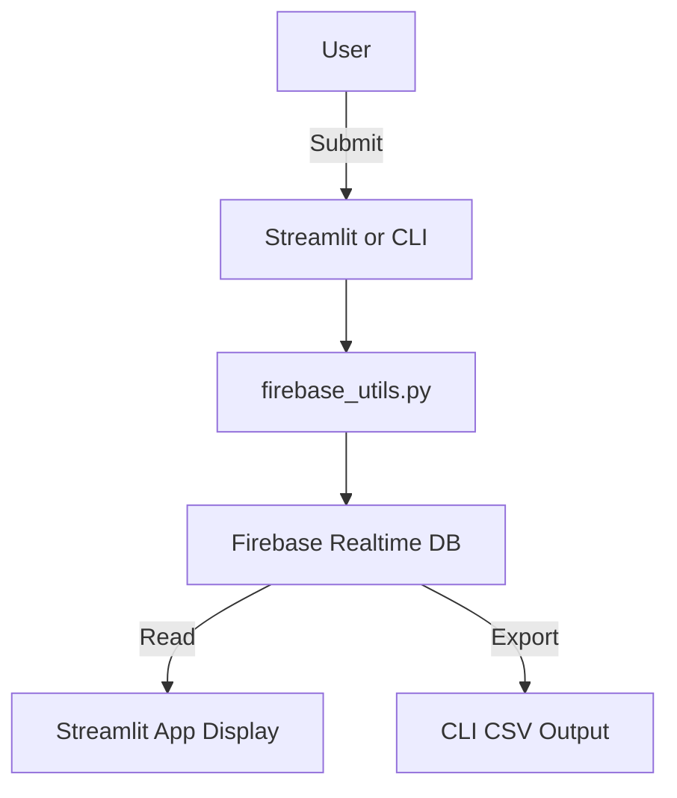

# ML Experiment Sharing Platform — Design Spec (spec.md)

## Project Summary
This tool implements a lightweight, community-driven dashboard for sharing ML experiments. It combines a simple Streamlit web interface with Firebase Realtime DB and Python CLI scripts to support reproducibility, traceability, and MLOps best practices.

---

## Core Design Principles
- Minimal barrier for contributors (no login; submission = access)
- Firebase used for scalability and cloud simplicity
- Streamlit used for rapid prototyping and visualization
- Docker ensures reproducibility on any machine
- CLI tools enhance automation and scripting flexibility

---

## Components & Architecture



---

## Functionalities Implemented

| Feature | Method | Description |
|--------|--------|-------------|
| Submit experiment | Streamlit + CLI | JSON entries submitted to Firebase |
| Access control | Firebase read logic | Users can only read after submitting |
| Browse database | Streamlit | Real-time table + filters |
| Export to CSV | CLI (`download_experiment.py`) | Full DB export |
| User filter | CLI (`get_submissions_from_user.py`) | Filter logs by email |
| Docker support | Dockerfile | Fully reproducible container |

---

## Design Decisions

- Firebase chosen for ease of integration and cost (free tier)
- Streamlit is ideal for quick dashboard deployment (esp. via Streamlit Cloud)
- Docker simplifies reproduction for teachers and students
- CLI tools mirror same backend code (`firebase_utils.py`) as UI
- Secure secrets managed via `.streamlit/secrets.toml`

---

## Manual Setup Instructions

### 1. Firebase
- Enable Realtime Database
- Generate service account JSON (do NOT commit to GitHub)

### 2. Local Development
```bash
pip install -r requirements.txt
streamlit run streamlit.py
```

### 3. CLI Usage
```bash
python cli/upload_experiment.py --email user@email.com ...
```

### 4. Docker
```bash
docker build -t mlops-dashboard .
docker run -p 8501:8501 mlops-dashboard
```

---

## Appendix: File Structure

```
MLOps-ml-experiment-sharing/
├── cli/
│   ├── upload_experiment.py
│   ├── download_experiment.py
│   ├── get_submissions_from_user.py
│   └── kikisubmit_test_entry.py
├── firebase_utils.py
├── streamlit.py
├── requirements.txt
├── Dockerfile
└── .streamlit/secrets.toml
```

---

## Possible Improvements
- Add login via Google OAuth (Firebase Auth)
- Add visual plots of parameter/result correlation
- Add user tags or project tags to logs
- Implement Firestore for more scalable structure
